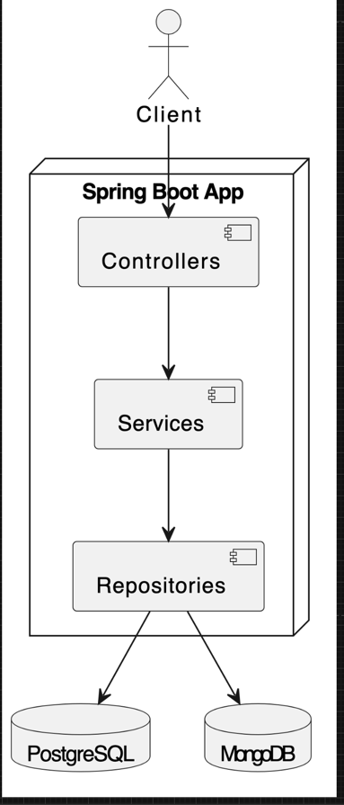

# Project Tracker

## Overview

Project Tracker is a comprehensive Spring Boot application designed for **BuildMaster** to efficiently manage projects, tasks, and developers. It provides a robust backend system with RESTful APIs for all core functionalities, along with advanced query capabilities and audit logging.

## Key Features

*   **Entity Management**: Full CRUD (Create, Read, Update, Delete) operations for Projects, Tasks, and Developers.
*   **Task Assignment**: Assign and unassign tasks to developers.
*   **Pagination & Sorting**: Efficiently browse through lists of projects, developers, and tasks with support for pagination and sorting by various attributes.
*   **Transactional Operations**: Ensures data integrity using Spring's transaction management.
*   **Caching**: Improves performance for frequently accessed data using Spring Cache.
*   **Audit Logging**: All C/U/D operations on major entities (Projects, Tasks, Developers) are logged to MongoDB for auditing purposes. An endpoint (`/logs`) can be implemented to view these logs.
*   **Advanced Queries & Endpoints**:
    *   Retrieve overdue tasks.
    *   Get the top N developers based on the number of completed tasks.
    *   Find projects that currently have no tasks.
    *   Aggregate task counts by their status (overall and per project).
*   **API Documentation**: Integrated Swagger UI for interactive API documentation and testing.
*   **Email Notifications**: Automated email alerts for overdue tasks, with configurable SMTP settings. Notifications are sent daily at 8 AM and can also be triggered manually via API.

## Technologies Used

*   **Backend**: Java 17, Spring Boot 3.3.1
*   **Data Persistence**:
    *   Spring Data JPA with Hibernate (for relational data)
    *   PostgreSQL (Primary RDBMS)
    *   Spring Data MongoDB (for audit logs)
    *   MongoDB
*   **API & Web**: Spring Web (RESTful APIs)
*   **Caching**: Spring Cache (default ConcurrentMapCacheManager, configurable for others like Caffeine)
*   **Utilities**: Lombok
*   **Build Tool**: Apache Maven
*   **API Documentation**: SpringDoc OpenAPI (Swagger UI)
*   **Development Tools**: Spring Boot DevTools


## Prerequisites

Before you begin, ensure you have met the following requirements:

*   Java Development Kit (JDK) 17 or later
*   Apache Maven 3.6.x or later
*   PostgreSQL server installed and running
*   MongoDB server installed and running

## Setup and Installation

1.  **Clone the repository**:
    ```bash
    git clone <your-repository-url>
    cd ProjectTracker
    ```
2.  **Configure `application.properties`**:
    Open `src/main/resources/application.properties` and update the following properties with your local database credentials and settings:
    *   `spring.datasource.url` (e.g., `jdbc:postgresql://localhost:5432/your_db_name`)
    *   `spring.datasource.username`
    *   `spring.datasource.password`
    *   `spring.data.mongodb.uri` (e.g., `mongodb://localhost:27017/your_audit_db_name`)

3.  **Build the project using Maven**:
    ```bash
    mvn clean install
    ```

## Running the Application

1.  **Using Maven Spring Boot plugin**:
    ```bash
    mvn spring-boot:run
    ```
2.  **From your IDE**:
    Locate the `ProjectTrackerApplication.java` class and run it as a Java application.

Once started, the application will be accessible at `http://localhost:8080`.

## API Endpoints & Documentation

### Notification Endpoints

- `POST /api/tasks/notifications/send-overdue` - Manually trigger overdue task notifications
- `GET /api/tasks/overdue` - Get a paginated list of overdue tasks
- `GET /api/tasks/overdue/list` - Get a complete list of overdue tasks (non-paginated)

All API endpoints are documented using Swagger/OpenAPI.

*   **Swagger UI**: [http://localhost:8080/swagger-ui.html](http://localhost:8080/swagger-ui.html)
*   **OpenAPI v3 Spec**: [http://localhost:8080/v3/api-docs](http://localhost:8080/v3/api-docs)

## Database Schema (ERD)

Below is the Entity Relationship Diagram for the relational database (PostgreSQL).


*Example `dbdiagram.io` code was provided previously to generate this.* 

## High-Level System Architecture Diagram



## Future Enhancements / To-Do

*   Introduce REST API versioning strategy.
*   Enhance caching mechanisms (e.g., configure Caffeine with Time-To-Live settings).
*   Develop comprehensive unit and integration tests for all services and controllers.
*   Implement security features (e.g., Spring Security for authentication and authorization).
*   Add email templates and support for HTML emails.
*   Implement notification preferences for developers.
*   Add email delivery status tracking and retry mechanisms.

## Contributing

Contributions are welcome! Please follow the standard fork-and-pull request workflow. Ensure your code adheres to the project's coding standards and includes appropriate tests.

## License

This project is licensed under the MIT License - see the [LICENSE](LICENSE) file for details.

```
MIT License

Copyright (c) 2025 Caleb levy Buntu

Permission is hereby granted, free of charge, to any person obtaining a copy
of this software and associated documentation files (the "Software"), to deal
in the Software without restriction, including without limitation the rights
to use, copy, modify, merge, publish, distribute, sublicense, and/or sell
copies of the Software, and to permit persons to whom the Software is
furnished to do so, subject to the following conditions:

The above copyright notice and this permission notice shall be included in all
copies or substantial portions of the Software.

THE SOFTWARE IS PROVIDED "AS IS", WITHOUT WARRANTY OF ANY KIND, EXPRESS OR
IMPLIED, INCLUDING BUT NOT LIMITED TO THE WARRANTIES OF MERCHANTABILITY,
FITNESS FOR A PARTICULAR PURPOSE AND NONINFRINGEMENT. IN NO EVENT SHALL THE
AUTHORS OR COPYRIGHT HOLDERS BE LIABLE FOR ANY CLAIM, DAMAGES OR OTHER
LIABILITY, WHETHER IN AN ACTION OF CONTRACT, TORT OR OTHERWISE, ARISING FROM,
OUT OF OR IN CONNECTION WITH THE SOFTWARE OR THE USE OR OTHER DEALINGS IN THE
SOFTWARE.
```
